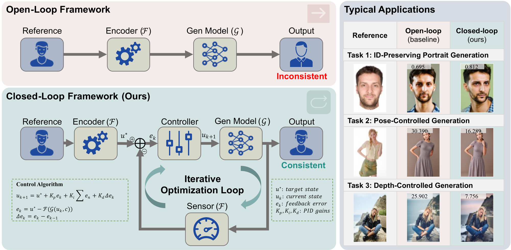

# From Open Loop to Closed Loop: A Test-Time Iterative Optimization Framework for Reference-Consistent Image Generation

<p align="center">
  🎉 <b>Accepted to ECCV 2026</b> 🎉
</p>

This is the official repository for:

> **From Open Loop to Closed Loop: A Test-Time Iterative Optimization Framework for Reference-Consistent Image Generation**
>
> *ECCV 2026*

**Baixuan Zhao**<sup>1</sup>, **Xinyu Zhang**<sup>2</sup>, **Huayu Zheng**<sup>1</sup>, **Shuaicheng Liu**<sup>2</sup>, **Xiongkuo Min**<sup>1</sup>, **Guangtao Zhai**<sup>1</sup>, **Xiaohong Liu**<sup>1,\*</sup>

<sup>1</sup>&nbsp;Shanghai Jiao Tong University &nbsp;&nbsp; <sup>2</sup>&nbsp;University of Electronic Science and Technology of China

<sup>\*</sup>&nbsp;Corresponding author (xiaohongliu@sjtu.edu.cn)

---

<p align="center">
  
</p>
<p align="center"><b>Overview. We reformulate reference-consistent generation as a closed-loop dynamic tracking problem: the pre-trained generator is a control plant driven by a modified PID sensor–controller.</b></p>

<!-- ## 📰 News

- **[2026]** 🔥 Code release for the **Portrait** setting (SDXL + IP-Adapter FaceID). -->

## 📖 Introduction

Controllable image generation has advanced rapidly by injecting visual reference conditions, yet existing methods predominantly operate as **open-loop systems**: control signals are fed in a strictly feed-forward manner, with **no active feedback or error correction** — so they cannot guarantee strict fidelity to the reference.

We propose a **test-time iterative optimization framework** that reformulates reference-consistent generation as a **closed-loop dynamic tracking problem**. Treating the pre-trained generative model as a **control plant**, the framework adopts a **sensor–controller architecture** driven by a **modified PID (Proportional–Integral–Derivative) algorithm**: at each round the sensor measures the discrepancy between the generated output and the reference target, and the controller iteratively corrects the **latent control signal**.

The approach is entirely **training-free** and **model-agnostic**, integrating seamlessly around existing diffusion pipelines. We validate its **universality** across three settings — **ID-preserving**, **pose-controlled**, and **depth-controlled** generation — each provided here as a minimal closed-loop script.

### The PID update rule

```
delta      = origin_faceid_embeds - gen_faceid_embeds            # error = reference - generated
sum_delta += delta                                               # integral term
faceid_embeds = origin_faceid_embeds
              + kp * delta                       # proportional
              + ki * sum_delta                   # integral
              + kd * (delta - delta0)            # derivative
delta0     = delta                                              # store for next derivative
```

Shown for the face-identity signal (Portrait); the identical rule is applied to the depth map and pose keypoints in the Spatial scripts. Across iterations the best image is kept — highest identity similarity (Portrait), or lowest spatial error (Spatial).

## 📈 Results

The closed-loop framework improves over **computation-matched open-loop baselines** across all three settings, while being **training-free** and **model-agnostic**:

| Setting | Metric | Gain over open-loop |
|---------|--------|:---:|
| ID-preserving (Portrait) | Facial similarity | **+25.36%** (relative) |
| Pose-controlled (Spatial) | Pose alignment error | **−27.71%** |
| Depth-controlled (Spatial) | Depth consistency error | **−28.50%** |

*Relative improvement / error reduction, up to the value shown.*

## 🗂️ Repository Structure

The same closed-loop PID recipe is applied to two reference-consistency settings:

```
From_Open_Loop_to_Closed_Loop/
├── Portrait/                         # Identity: face embedding is the control signal
│   ├── pid_ipa.py                    # SDXL + IP-Adapter FaceID
│   ├── pid_photomaker.py             # SDXL + PhotoMaker-V2
│   ├── pid_pulid.py                  # SDXL + PuLID
│   └── pid_instantid.py              # SDXL + InstantID
└── Spatial/                          # Spatial: spatial condition is the control signal
    ├── pid_depth.py                  # SDXL + ControlNet Union (depth map)
    └── pid_pose.py                   # SDXL + ControlNet Union (OpenPose keypoints)
```

Each script is a minimal, self-contained reference implementation of the closed-loop loop for its setting — model setup, a single reference signal extracted once as the setpoint, then `max_iter` PID-corrected rounds with the bare update rule:

**Portrait (identity consistency)** — four interchangeable backbones, all control the reference face embedding:

- **`pid_ipa.py`** — SDXL + IP-Adapter FaceID. PID correction applied to the FaceID condition embedding.
- **`pid_photomaker.py`** — SDXL + PhotoMaker-V2. PID correction applied to the stacked id embedding (`id_embeds`).
- **`pid_pulid.py`** — SDXL + PuLID. PID correction applied to the conditional slice of the PuLID id embedding (`[1:2]`).
- **`pid_instantid.py`** — SDXL + InstantID. PID correction applied to the face embedding (`image_embeds`), with the facial-landmark map held fixed.

**Spatial (spatial consistency):**

- **`pid_depth.py`** — depth consistency. Extracts the reference depth map (MiDaS), then each round measures the depth-map error and feeds a PID correction back into the ControlNet depth condition.
- **`pid_pose.py`** — pose consistency. Extracts the reference body keypoints (OpenPose), then each round measures the keypoint error and feeds a PID correction back into the ControlNet pose condition.

## 🛠️ Environment

- Python 3.8+
- PyTorch (with CUDA)
- [diffusers](https://github.com/huggingface/diffusers)
- [insightface](https://github.com/deepinsight/insightface) (`buffalo_l` + `antelopev2` model packs) — *Portrait only*
- [controlnet_aux](https://github.com/patrickvonplaten/controlnet_aux) (MiDaS, OpenPose) — *Spatial only*
- OpenCV (`opencv-python`)
- NumPy
- `huggingface_hub`

Each Portrait/Spatial backbone also needs its own method package importable (clone the official repo and run from there, or pip-install it):

- **Portrait** — [IP-Adapter](https://github.com/tencent-ailab/IP-Adapter) (`pid_ipa.py`), [PhotoMaker](https://github.com/TencentARC/PhotoMaker) (`pid_photomaker.py`), [PuLID](https://github.com/ToTheBeginning/PuLID) (`pid_pulid.py`), [InstantID](https://github.com/InstantID/InstantID) (`pid_instantid.py`).
- **Spatial** — clone the [ControlNet Union](https://huggingface.co/xinsir/controlnet-union-sdxl-1.0) repo and point the `sys.path.insert` line at the top of each script at it, so that `models.controlnet_union` and `pipeline.pipeline_controlnet_union_sd_xl` are importable.

```bash
pip install torch torchvision
pip install diffusers transformers accelerate huggingface_hub
pip install insightface onnxruntime-gpu opencv-python numpy
pip install controlnet_aux       # for Spatial/pid_depth.py, pid_pose.py
```

## 📦 Models

Checkpoints used by each setting (download them and place them locally, then edit the paths at the top of the relevant script):

**Portrait**

| Script | Backbone | Key checkpoint(s) |
|--------|----------|-------------------|
| `pid_ipa.py` | SDXL + IP-Adapter FaceID | base [`SG161222/RealVisXL_V4.0`](https://huggingface.co/SG161222/RealVisXL_V4.0); [`ip-adapter-faceid-portrait_sdxl.bin`](https://huggingface.co/h94/IP-Adapter) |
| `pid_photomaker.py` | SDXL + PhotoMaker-V2 | base [`SG161222/RealVisXL_V4.0`](https://huggingface.co/SG161222/RealVisXL_V4.0); [`photomaker-v2.bin`](https://huggingface.co/TencentARC/PhotoMaker-V2) |
| `pid_pulid.py` | SDXL + PuLID | `PuLIDPipeline()` loads its own weights internally; antelopev2 face model |
| `pid_instantid.py` | SDXL + InstantID | base [`stabilityai/stable-diffusion-xl-base-1.0`](https://huggingface.co/stabilityai/stable-diffusion-xl-base-1.0); `./checkpoints/ip-adapter.bin`, `./checkpoints/ControlNetModel`; antelopev2 face model |

**Spatial**

| Component | Source |
|-----------|--------|
| Base SDXL model | [`stabilityai/stable-diffusion-xl-base-1.0`](https://huggingface.co/stabilityai/stable-diffusion-xl-base-1.0) |
| SDXL VAE | [`madebyollin/sdxl-vae-fp16-fix`](https://huggingface.co/madebyollin/sdxl-vae-fp16-fix) |
| ControlNet Union | [`xinsir/controlnet-union-sdxl-1.0`](https://huggingface.co/xinsir/controlnet-union-sdxl-1.0) |
| MiDaS depth annotator | [`lllyasviel/Annotators`](https://huggingface.co/lllyasviel/Annotators) (*depth*) |
| OpenPose annotator | [`lllyasviel/ControlNet`](https://huggingface.co/lllyasviel/ControlNet) (*pose*) |

The InsightFace `buffalo_l` / `antelopev2` model packs are downloaded automatically by `insightface` on first run.

## 🚀 Usage

1. Open the relevant script and set, near the top:
   - `image` — path to your reference image (face for the Portrait scripts, a scene/figure for the Spatial scripts),
   - `output_name` — path to save the generated image,
   - model/checkpoint paths as listed in [Models](#-models).
2. (Optional) Tune the controller gains. Default illustrative values:
   - `Portrait/pid_ipa.py` — `kp=0.3, ki=0.05, kd=0.03`
   - `Portrait/pid_photomaker.py` / `pid_pulid.py` / `pid_instantid.py` — `kp=0.3, ki=0.09, kd=0.01`
   - `Spatial/pid_depth.py` — `kp=0.01, ki=0.005, kd=0.005`
   - `Spatial/pid_pose.py` — `kp=0.05, ki=0.02, kd=0.01`
   
   all with `max_iter=20`.
3. Run (from within the backbone's own repo so its modules import, or with it pip-installed):

```bash
cd Portrait && python pid_ipa.py            # IP-Adapter FaceID
cd Portrait && python pid_photomaker.py     # PhotoMaker-V2
cd Portrait && python pid_pulid.py          # PuLID
cd Portrait && python pid_instantid.py      # InstantID
# or
cd Spatial  && python pid_depth.py          # depth
cd Spatial  && python pid_pose.py           # pose
```

Each script writes the generated image to `output_name` on every iteration, so the last written image is the result of the final PID-corrected round.

<!-- ## 📚 Citation

If you find this work useful, please cite:

```bibtex
@inproceedings{zhao2026fromopenclosed,
  title     = {From Open Loop to Closed Loop: A Test-Time Iterative Optimization Framework for Reference-Consistent Image Generation},
  author    = {Zhao, Baixuan and Zhang, Xinyu and Zheng, Huayu and Liu, Shuaicheng and Min, Xiongkuo and Zhai, Guangtao and Liu, Xiaohong},
  booktitle = {Proceedings of the European Conference on Computer Vision (ECCV)},
  year      = {2026}
}
``` -->

## 🙏 Acknowledgements

This project builds on a number of excellent open-source works. Our closed-loop PID recipe is a test-time wrapper applied on top of the following identity- and spatial-conditioning backbones:

- **Portrait (identity):** [IP-Adapter](https://github.com/tencent-ailab/IP-Adapter), [PhotoMaker](https://github.com/TencentARC/PhotoMaker), [PuLID](https://github.com/ToTheBeginning/PuLID), and [InstantID](https://github.com/InstantID/InstantID).
- **Spatial (spatial conditioning):** [ControlNet Union](https://huggingface.co/xinsir/controlnet-union-sdxl-1.0) (ControlNet), with depth / pose annotations from [MiDaS](https://github.com/isl-org/MiDaS) and [OpenPose](https://github.com/CMU-Perceptual-Computing-Lab/openpose) via [controlnet_aux](https://github.com/patrickvonplaten/controlnet_aux).
- **Foundation:** [diffusers](https://github.com/huggingface/diffusers) and [InsightFace](https://github.com/deepinsight/insightface) (`buffalo_l` / `antelopev2`).

We sincerely thank the authors of all these projects for releasing their code and models.

## 📄 License

This project is released under the MIT License. The pre-trained models and third-party packages retain their respective licenses.
